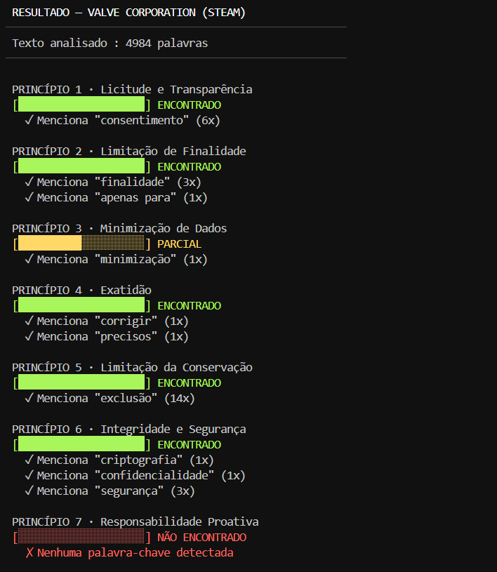
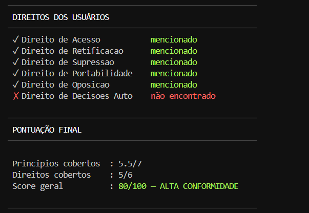

<p align="center">
  
</p>

<p align="center">
  
  
  
</p>

---

## 📖 Sobre a Origem do Projeto

Este é o primeiro de uma série de projetos que estou desenvolvendo como pratica do curso **CIBERSEGURIDAD APLICADA: REGLAMENTOS, INTELIGENCIA Y DEFENSA**[cite: 1].

> Este curso ha sido ofrecido por **CIBERIA**, proyecto coordinado por la **Universidad de Salamanca**, cuyo objetivo es lograr la digitalización de empresas y organismos públicos de Castilla y León y el centro de Portugal (zona CENCYL)[cite: 1].
> 
> Para lograr un ecosistema seguro, ofrece servicios gratuitos entre los que destacan el Sello de Confianza, la monitorización continua (SOC) y el cumplimiento normativo obligatorio (CRA, NIS/NIS2)[cite: 1]. 
> 
> *Al registrarte aceptas recibir una comunicación en forma de asesoramiento sobre el Sello de Confianza y el SOC-T.*[cite: 1]

---

## 🎯 O Porquê deste Projeto (Justificativa)

A proteção de dados e a segurança da informação andam lado a lado. Enquanto a segurança ofensiva (Red Team) foca em identificar vulnerabilidades na infraestrutura técnica, a transparência foca em auditar como as empresas lidam com a privacidade humana. 

Construí este analisador para automatizar a verificação de conformidade de contratos reais. O objetivo é expor lacunas de transparência, punindo omissões e verificando de forma matemática se as políticas respeitam os **7 Princípios do RGPD** e garantem os **Direitos dos Usuários**, conectando a ética de dados com a cibersegurança aplicada.

### Elementos do Analisador
* **Motor de Busca Lexical:** Mapeamento de jargões jurídicos reais (DPO, consentimento, minimização).
* **Terminal UI (TUI):** Interface desenvolvida nativamente com códigos ANSI para feedbacks visuais imediatos.
* **Scoring Ponderado:** Cálculo de 0 a 100 baseado na presença ou ausência de obrigações legais críticas.

---

## 💻 Exemplo Prático de Execução

Ao colar o contrato massivo de uma plataforma, o sistema destrincha as cláusulas e gera o relatório visual no terminal. 

Abaixo, um exemplo real da varredura feita na política da **VALVE CORPORATION (STEAM)**, demonstrando como a ferramenta identifica o que foi atendido e alerta para ausências críticas (como Decisões Automatizadas e Responsabilidade Proativa)[cite: 1]:

<p align="center">
  <!-- Imagens lado a lado: garanta que você salvou as duas partes do print na pasta assets -->
  
  
</p>

---

## 🚀 Como Executar Localmente

Ferramenta desenvolvida 100% em Python padrão, sem necessidade de dependências externas.

1. Clone o repositório:
   ```bash
   git clone [https://github.com/suares13/privacy-policy-auditor.git](https://github.com/suares13/privacy-policy-auditor.git)
   ```
2. Acesse a pasta do projeto:
   ```bash
   cd privacy-policy-auditor
   ```
3. Execute o analisador:
   ```bash
   python analisador.py
   ```
4. Digite o nome da empresa, cole o texto da política no terminal, pule uma linha, digite `FIM` e aperte **Enter**.

---

## 👩‍💻 Autora

**Victória Santos Suares da Silva**  
*Estudante de Engenharia de Software e Pesquisadora em Inteligência Artificial Justa e Transparente.*   
Foco em Segurança Ofensiva, Análise de Vulnerabilidades e Ciberdireito.

* **LinkedIn:** [https://www.linkedin.com/in/victoria-suares/](https://www.linkedin.com/in/victoria-suares/)
* **GitHub:** [@suares13](https://github.com/suares13)
